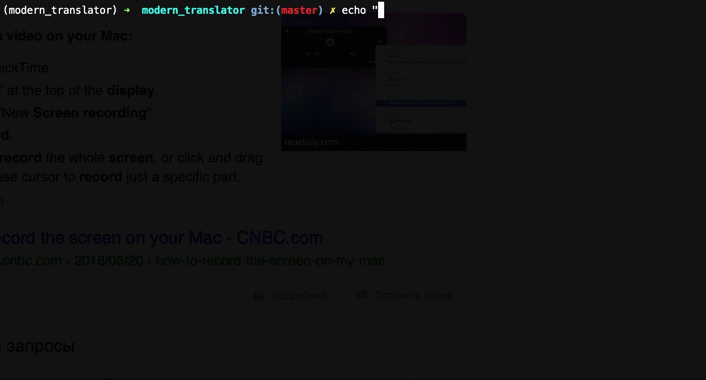

# langswi

Keyboard layout switcher for cyrillic-latin & reversed symbols.

## First of all

Install the package:

```
pip install langswi
```

When layout will be missed, just copy text into the buffer and type: 

```
langswi
```



## That's it.
